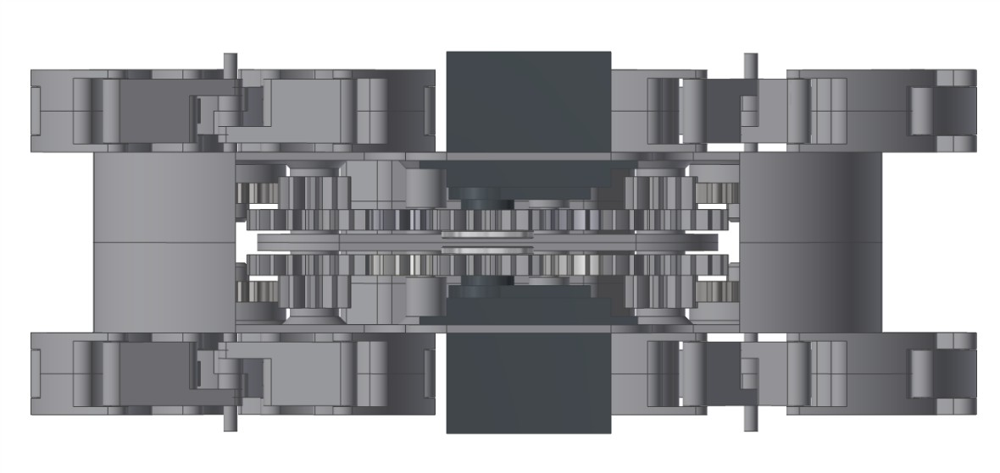
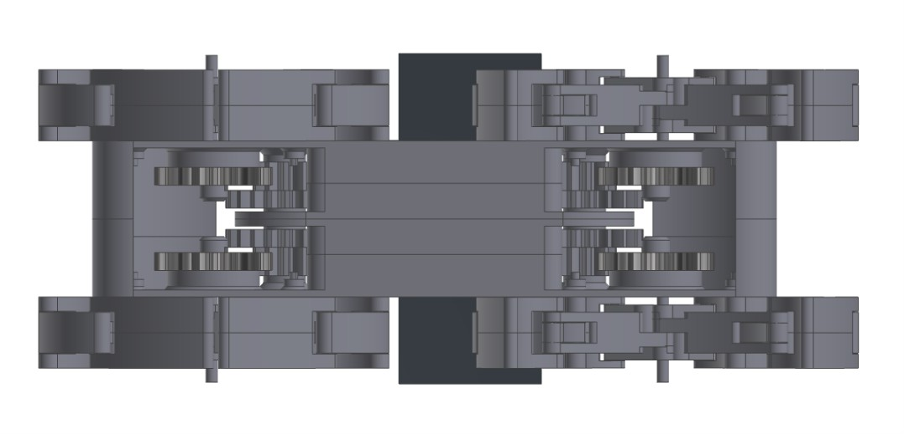

Title: 期末專題報告
Date: 2017-06-21 12:08
Category:期末報告
Tags: 期末報告
Author: AG1 

利用仿生獸的機構原理,利用到行走機構上
<!-- PELICAN_END_SUMMARY -->

在學期初，老師有交代每組要做出一台四足行走機構，且要想辦法使其能夠行走。
於是大家不眠不休地討論 、研究、尋找還有後來專業的畫圖跟列印。才有今天的四足行走機構！

工作分配:

40423105:利用vrep模擬機構,撰寫行走程式

40423119:利用vrep模擬機構

40423128:利用vrep模擬機構

40423130:組裝,給予意見

40423133:組裝,給予意見

40423137:繪製零件圖檔,組裝,製作動畫,零件3D列印

40423144:組裝,給予意見,製作網頁

40443111:組裝,給予意見

<h2>等角視圖</h2>

<h2>前視圖</h2>

<h2>上視圖</h2>

<h2>右視圖</h2>

<h2>下視圖</h2>

<h2>測試影片</h2>

<iframe width="560" height="315" src="https://www.youtube.com/embed/1uautiDWBz4" frameborder="0" allowfullscreen></iframe>

<h2>模擬影片</h2>

<iframe width="560" height="315" src="https://www.youtube.com/embed/12Tex9wk5eQ" frameborder="0" allowfullscreen></iframe>

<h2>Arduino程式碼</h2>

